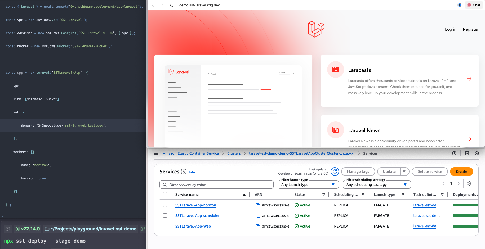

# SST Laravel

[Read the documentation](https://docs.kirschbaumdevelopment.com/projects/sst-laravel/)

SST Laravel uses [SST](https://sst.dev) to deploy Laravel applications to AWS Fargate in your own AWS account. It is developed by [Kirschbaum Development](https://kirschbaumdevelopment.com).

Define your web service, queue workers, scheduler, Reverb, and linked AWS resources in code. SST Laravel builds the Docker images and deploys the infrastructure for you.

## Documentation

Installation, configuration, deployment, and troubleshooting are covered in the [documentation](https://docs.kirschbaumdevelopment.com/projects/sst-laravel/). Start here:

- [Getting started](https://docs.kirschbaumdevelopment.com/projects/sst-laravel/reference/docs/getting-started/)
- [Onboard your agent](https://docs.kirschbaumdevelopment.com/projects/sst-laravel/onboard-your-agent/)
- [API reference](https://docs.kirschbaumdevelopment.com/projects/sst-laravel/reference/docs/api/)

## Changelog

See [CHANGELOG.md](CHANGELOG.md) for what changed in each release.

## Security

If you discover any security related issues, please email security@kirschbaumdevelopment.com instead of using the issue tracker.

## Sponsorship

Development of this package is sponsored by Kirschbaum Development Group, a developer driven company focused on problem solving, team building, and community. Learn more [about us](https://kirschbaumdevelopment.com) or [join us](https://careers.kirschbaumdevelopment.com)!

## License

The MIT License (MIT). Please see [License File](LICENSE.md) for more information.
