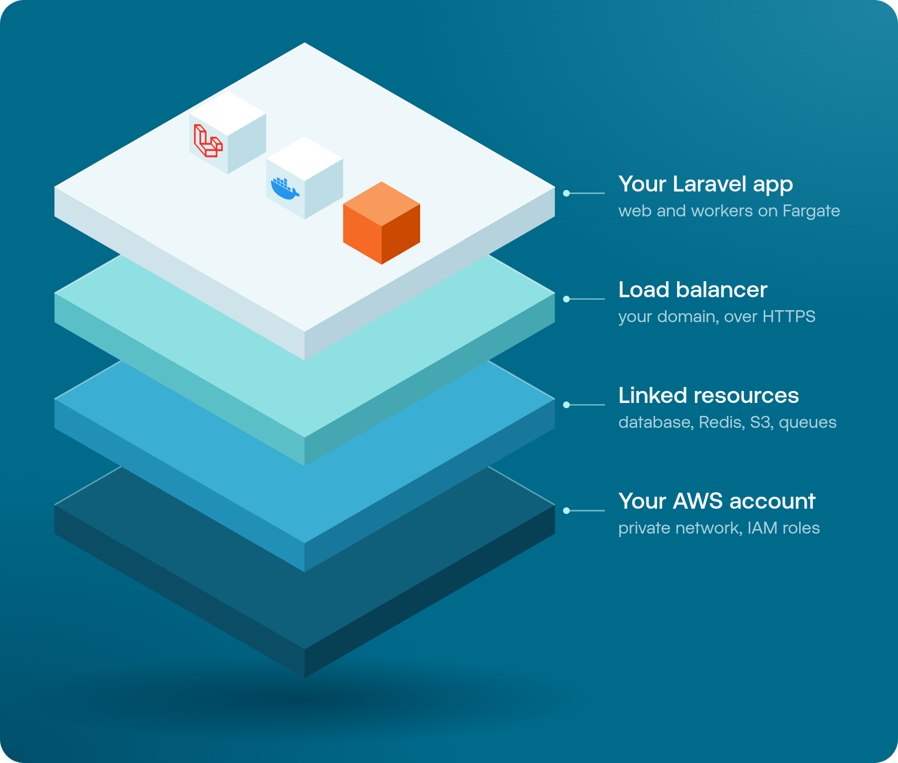
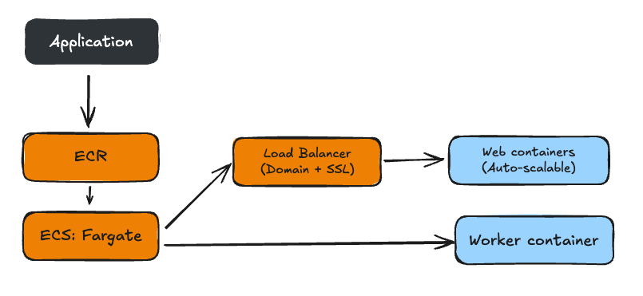

# SST Laravel



SST Laravel makes it easy to deploy secure, reliable, and scalable Laravel applications to AWS.

SST Laravel uses [SST](https://sst.dev) to deploy Laravel applications to AWS Fargate in your own AWS account. It is developed by [Kirschbaum Development](https://kirschbaumdevelopment.com).

Secure defaults, support for auto-scaling, and deployments with health checks and automatic rollbacks are built in.

## What gets deployed

Behind the scenes, SST Laravel uses the SST Cluster + Service component, which deploys custom Docker containers to AWS Fargate. It all gets deployed on your own AWS account, and you have full control over the infrastructure and which services are connected to your application.

This package deploys a full-blown infrastructure in AWS, with zero downtime deployments, as you can see in the image below.

Behind the scenes, we use the powerful PHP containers from [Serverside Up](https://serversideup.net/open-source/docker-php/).

[Why SST Laravel](why-sst-laravel.md) explains what this setup gives you: infrastructure as code, auto-scaling, linked AWS resources, and security without long-lived AWS keys.



## Quick start

In your Laravel application:

```bash
npm install @kirschbaum-development/sst-laravel --save
npx sst-laravel init
npm run build   # the image copies vendor/ and public/build as they are
npx sst-laravel deploy --stage dev
```

`init` creates a minimal `sst.config.ts`: a VPC and one small web container that reads its environment from `.env.<stage>`. Before the first deploy, create `.env.dev` and trust the load balancer in your app. [Getting Started](getting-started.md) walks through each step.

From there, add what your application needs:

```ts
const app = new LaravelService("MyLaravelApp", {
  vpc,
  link: [database, redis],
  web: {
    size: "medium",
    domain: "app.example.com",
    healthCheck: { path: "/up" },
    scaling: { min: 1, max: 3 },
  },
  workers: [{ name: "horizon", horizon: true }],
  reverb: { domain: "ws.example.com" },
  config: {
    environment: { file: `.env.${$app.stage}` },
  },
});
```

## Onboard your agent

Start in your Laravel application and paste this into your coding agent:

```text
Fetch and follow the instructions at https://raw.githubusercontent.com/kirschbaum-development/sst-laravel/main/docs/agent-setup.md to set up and deploy this Laravel app with SST Laravel.
```

The agent installs the package and the [SST Laravel skill](../resources/boost/skills/sst-laravel/SKILL.md), checks your machine and AWS access, and looks at what your app needs. Before it changes anything, it shows you a plan: why SST Laravel, what it will create in AWS and the monthly cost, how the deploy works, and how to remove it. It asks what only you can decide, such as whether to add a database, and waits for your yes. Then it deploys a `dev` stage and checks the live `/up` endpoint. It never prints secret values.

To install or update only the skill:

```bash
npx sst-laravel skill:install
```

It copies the skill from the installed package, so it matches your version. With [Laravel Boost](https://laravel.com/docs/boost) set up, it goes to `.ai/skills` and `php artisan boost:update` runs. Otherwise it goes to `.agents/skills` and the folder of each agent set up in the project.

## Documentation

The documentation also lives in [`docs/`](README.md) and ships with the npm package:

| Page | What it covers |
| --- | --- |
| [Onboard your agent](#onboard-your-agent) | Set up your coding agent with the SST Laravel skill and deployment instructions. |
| [Why SST Laravel](why-sst-laravel.md) | What SST is, and what the setup gives you: infrastructure as code, auto-scaling, linked AWS resources, and security. |
| [Getting Started](getting-started.md) | Requirements, installation, the generated `sst.config.ts`, the first deploy, and checking it. |
| [Web](web.md) | The HTTP service: domain, container size, scaling, health check, HTTPS redirect, and access logs. |
| [Workers](workers.md) | Horizon, the scheduler, and custom commands in worker containers or in the web container. |
| [Reverb](reverb.md) | A dedicated Laravel Reverb service for WebSockets, with its own domain. |
| [Load Balancer](load-balancer.md) | The secure defaults of the load balancer, the IP allowlist, and access logs in S3. |
| [Environment Variables](environment-variables.md) | Environment files, SST secrets, `RemoteEnvVault` (AWS Secrets Manager), and the variables SST Laravel adds. |
| [Linking Resources](linking-resources.md) | Linked databases, Redis, and buckets, PlanetScale, custom variable names, and IAM permissions. |
| [Deploying](deploying.md) | The `deploy` command, readiness and status checks, PHP settings, the deployment script, and GitHub Actions. |
| [CLI](cli.md) | Every `sst-laravel` command and its options. |
| [Troubleshooting](troubleshooting.md) | Common errors and how to fix them. |
| [API Reference](api.md) | Every `LaravelService` and `RemoteEnvVault` option. |

## Requirements

- Node.js.
- SST 4.17.1 or later within version 4. The `init` command installs SST if it is missing.
- The [AWS CLI](https://docs.aws.amazon.com/cli/latest/userguide/getting-started-install.html), installed and configured. See the SST guide on [setting up IAM credentials](https://sst.dev/docs/iam-credentials/).
- [Docker](https://docs.docker.com/get-docker/), running. The deploy builds the container image on your machine.

## Roadmap

* Ability to extend base Docker images;
* Add support for Inertia SSR;
* Add support for Octane with FrankenPHP;
* Dev mode;
* ...what else are we missing?

## Changelog

See [CHANGELOG.md](../CHANGELOG.md) for what changed in each release.

## Security

If you discover any security related issues, please email security@kirschbaumdevelopment.com instead of using the issue tracker.

## Sponsorship

Development of this package is sponsored by Kirschbaum Development Group, a developer driven company focused on problem solving, team building, and community. Learn more [about us](https://kirschbaumdevelopment.com) or [join us](https://careers.kirschbaumdevelopment.com)!

## License

The MIT License (MIT). Please see [License File](../LICENSE.md) for more information.
